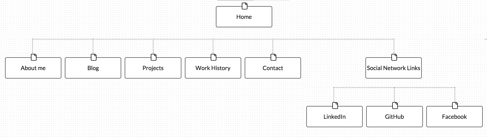

 

**What are the 6 Phases of Web Design?** 
1. Information Gathering 
2. Planning 
3. Design 
4. Devleopment 
5. Testing and Delivery 
6. Maintenance 

**What is your site's primary goal or purpose? What kind of content will your site feature?** 
My site's primary goal is to introduce myself to potential employers. The site will feature my picture, an "About Me" section, my blog, my work history, any projects I've made or worked on, a contact section, and links to social media. 

**What is your target audience's interests and how do you see your site addressing them?** 
My target audience - i.e. potential employers - will be interested in my overall employability. They will be looking for my previous work experiences, my capacity to learn and grow, my level of creativity and productivity; basically a snapshot of my personality and functionality. My site will provide this information in easily navigable pages, and the website itself will further address their interests since I created it. 

**What is the primary "action" the user should take when coming to your site? Do you want them to search for information, contact you, or see your portfolio? It's ok to have several actions at once, or different actions for different kinds of visitors.** 
Ultimately, I want the user to contact me for potential employment. They would do this by navigating through the information I have provided and deciding whether or not they would like to utilize my skills. I am still not sure whether I will want to work for a company or to do freelance work. Perhaps I will make sections for both types of visitors with respective actions. 

**What are the main things someone should know about design and user experience?** 
Design deals with how the content appears, e.g. whether or not it is visually appealing, how it can gear towards a target audience, etc. User experience deals with how a given user feels while navigating through the content, e.g. ease of use. Both design and user experience are essentially about problem solving.

**What is user experience design and why is it valuable?** 
User experience design is essentially the process of designing web content so the user feels good when they are using it. This is valuable because it makes the user want to come back to the site, thus maximizing traffic flow and sales, hits, or whatever it is you want to accomplish with your site. 

**Which parts of the challenge did you find tedious?** 
Writing this reflection has been the most tedious part. I understood the process while I was doing it, but putting it into words can be difficult for me.