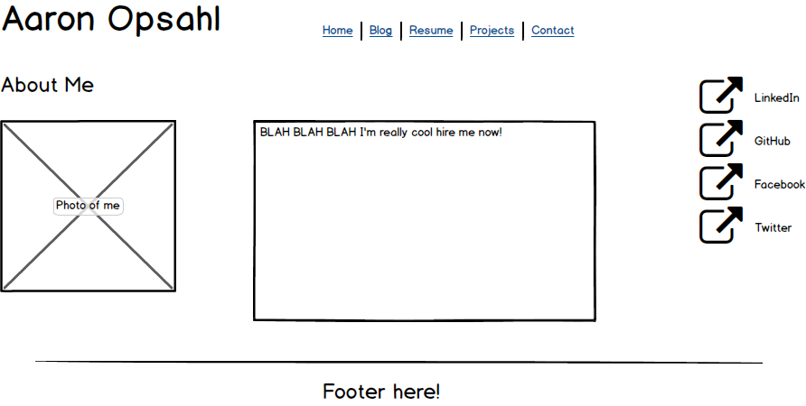
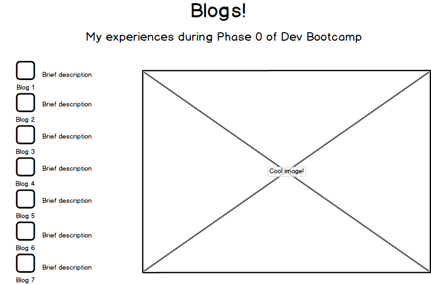

**What is a wireframe?**
A wireframe is essentially a visual sketch of how a website is going to be layed out. 

**What are the benefits of wireframing?**
Wireframing allows you to get a good idea of how your website will look before actually starting to program it. This is good for just getting ideas out, or if you are making a website for someone else so they can let you know if they like it before you move on.

**Did you enjoy wireframing your site?**
I did! I felt a little constrained with the time limit, and in fact spent more than an hour on the challenge. 

**Did you revise your wireframe or stick with your first idea?**
I revised my wireframe as I went. I like to experiment and put things together as I go and based on what makes the most sense visually.

**What questions did you ask during this challenge? What resources did you find to help you answer them?**
I wondered about what to put in a footer and found a page via google discussing "the anatomy of a footer".

**Which parts of the challenge did you enjoy and which parts did you find tedious?**
I enjoyed the visual aspect of designing the wireframe. I used Balsamiq Mockups 3 and found it to be very intuitive and fun. Figuring out all of the specific information that had to go into the wireframe was a bit tedious.