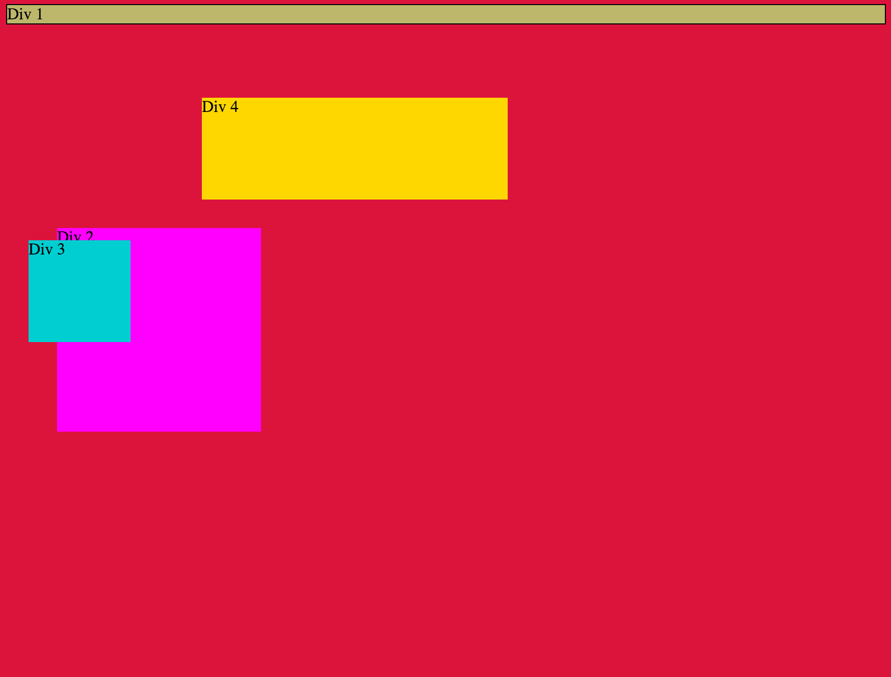
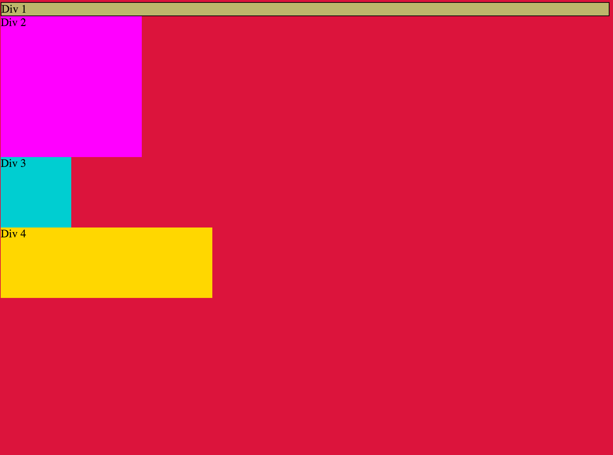
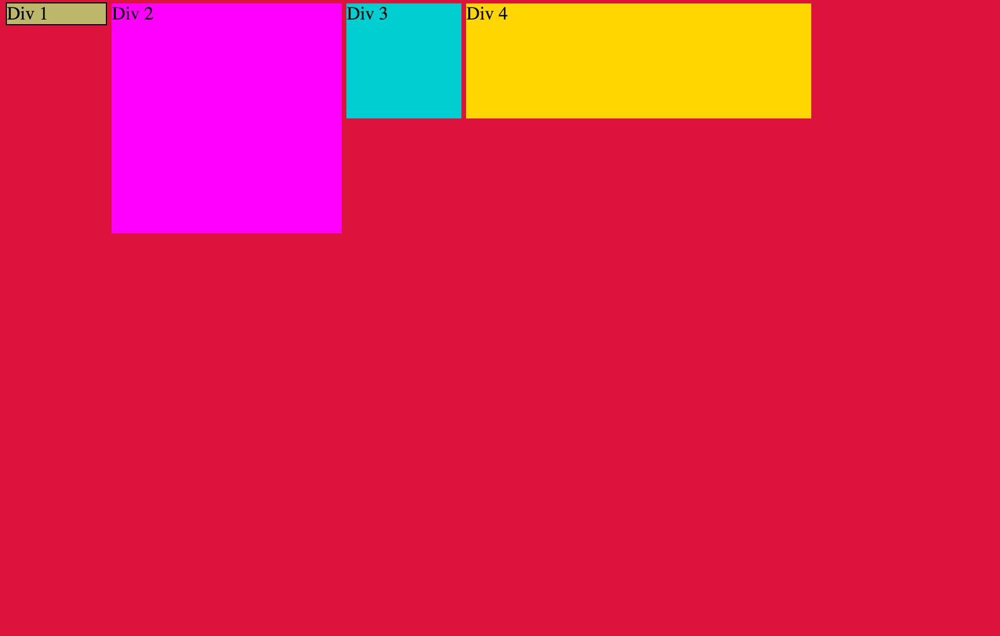
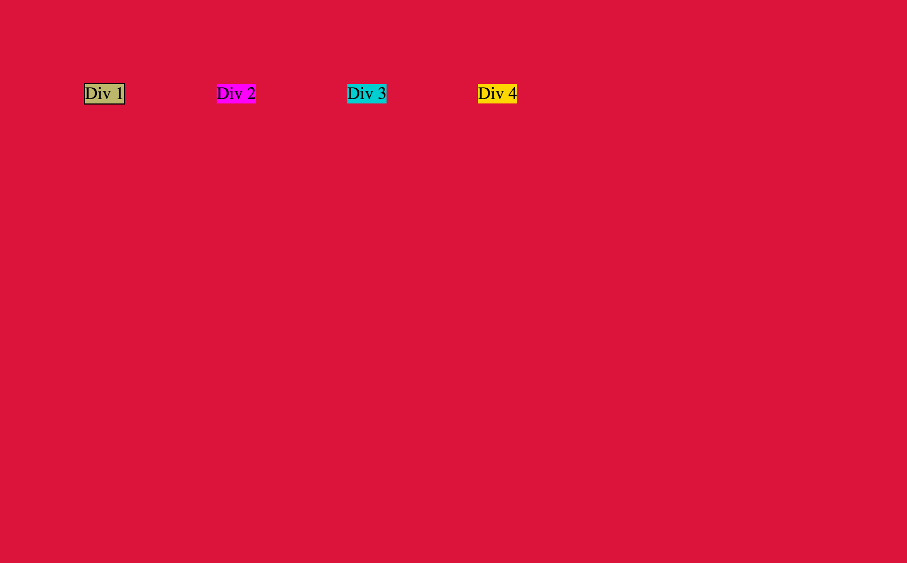
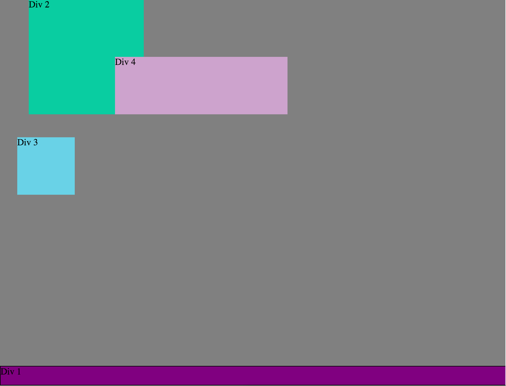
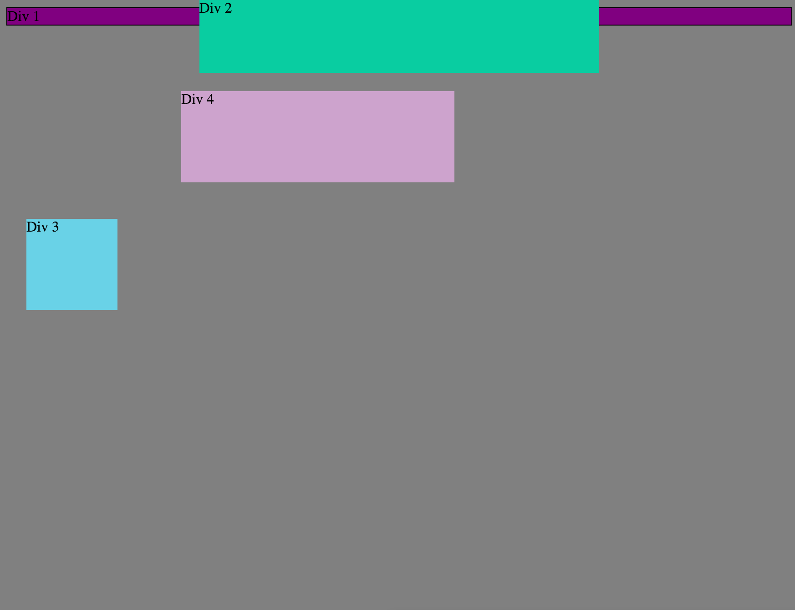
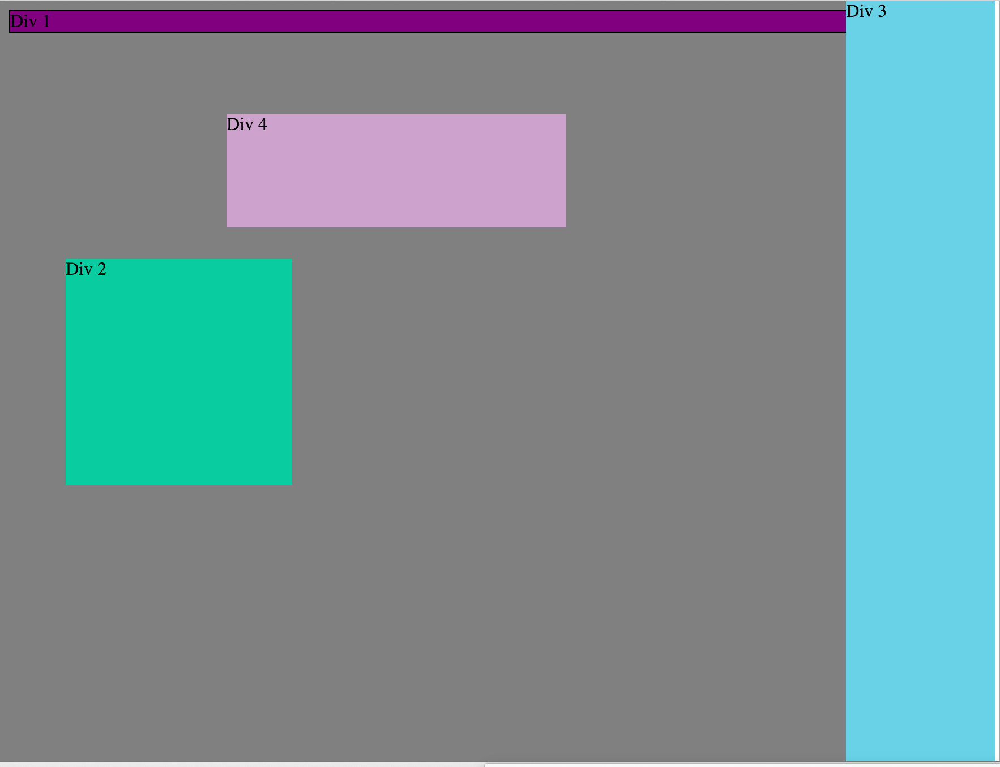
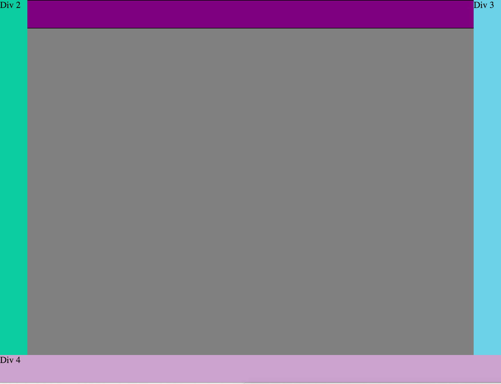

<h1>Images:</h1>

<h1>How can you use Chrome's DevTools inspector to help you format or position elements?</h1>

It helps you view any changes you make in real-time, making the design process much more fluid and experimental.

<h1>How can you resize elements on the DOM using CSS?</h1>

By using divs with ids, then changing the attributes of various elements, e.g. height, width, etc.

<h1>What are the differences between absolute, fixed, static, and relative positioning? Which did you find easiest to use? Which was most difficult?</h1>

Absolute positioning is where an element is positioned relative to the nearest ancestor. Fixed positioning is where the element doesn't move when you scroll. Static positioning is where an element is positioned according to the normal flow of the page; this is the default setting. Relative positioning is where an element is positioned relative to it's original position. I think fixed is the easiest to use and absolute is the most difficult.

<h1>What are the differences between margin, border, and padding?</h1>

Margin is the area between the border of an element and the edge of the page. Border is the area between the margin of an element and the padding. Padding is the area between the border of an element and the element itself.

<h1>What was your impression of this challenge overall? (love, hate, and why?)</h1>

I loved this challenge! I often lost track of what we were doing or had done, but the process was really fun! I love the fluid process of designing.