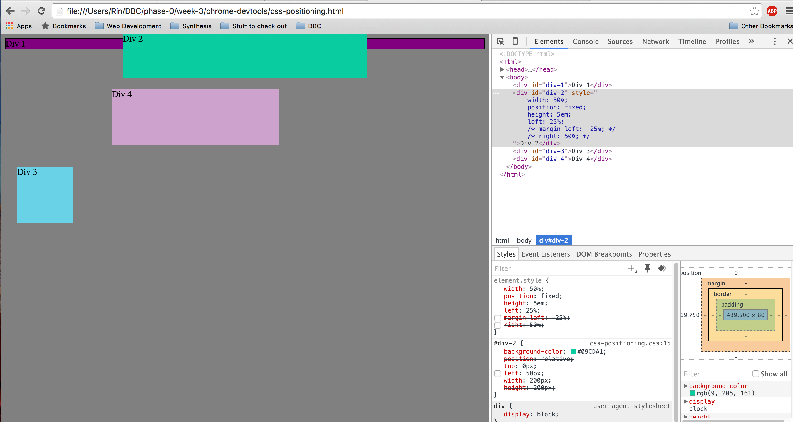

<h1>Images:</h1>

1:   
2:   
3:   
4:   
5:   
6:   
7:   
8:   
9:   

<h1>How can you use Chrome's DevTools inspector to help you format or position elements?</h1>

It helps you view any changes you make in real-time, making the design process much more fluid and experimental. This way, you can change things and see immediate results, all without changing the actual file. Very useful indeed!

<h1>How can you resize elements on the DOM using CSS?</h1>

By using divs with ids, then changing the attributes of various elements, e.g. height, width, etc. When trying to position elements evenly, we found it useful to use percentage values in stead of em or px. For example, using width: 50% instead of something like width: 15em. This way it also accounts for the size of the page it is being displayed on.

<h1>What are the differences between absolute, fixed, static, and relative positioning? Which did you find easiest to use? Which was most difficult?</h1>

Absolute positioning is where an element is positioned relative to the nearest ancestor. Fixed positioning is where the element doesn't move when you scroll. Static positioning is where an element is positioned according to the normal flow of the page and not affected by left, right, top, or bottom properties; this is the default setting. Relative positioning is where an element is positioned relative to it's original position. I don't really find any to be easier than the other, it just really depends on what you want to do. I never used relative positioning and it sounds like it would be difficult to use if you have a bunch of other elements. I suppose absolute positioning makes the most sense to me; you can just move it wherever you want on the page without having to worry about the other elements.

<h1>What are the differences between margin, border, and padding?</h1>

Margin is the area between the border of an element and the edge of the page. Border is the area between the margin of an element and the padding. Padding is the area between the border of an element and the element itself.

<h1>What was your impression of this challenge overall? (love, hate, and why?)</h1>

I loved this challenge! Some of the positioning was tedious or confusing at first, but once we figured it out it seemed so simple in retrospect. It was fun to experiement and find different ways to position things, especially whilst having a partner to bounce ideas off of.