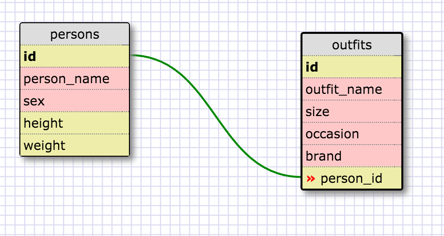

# 8.4: Introduction to Database Schemas and SQL

1. SELECT * FROM states;  

2. SELECT * FROM regions;  

3. SELECT state_name, population FROM states;  

4. SELECT state_name, population FROM states  
	 ORDER BY population DESC;  

5. SELECT state_name FROM states  
	 WHERE region_id=7;  

6. SELECT state_name, population_density FROM states  
	 WHERE population_density > 50  
	 ORDER BY population_density ASC;  

7. SELECT state_name FROM states  
	 WHERE population BETWEEN 1000000 AND 1500000;  

8. SELECT state_name, region_id FROM states;  
	 ORDER BY region_id ASC;  

9. SELECT region_name FROM regions  
	 WHERE region_name LIKE '%Central%';  

10. SELECT regions.region_name, states.state_name  
	 	FROM regions INNER JOIN states ON regions.id = states.region_id  
   	ORDER BY regions.id ASC;  

---

# Reflection

**1. What are databases for?**

Databases are for storing large amounts of data so you don't use up as much space. They are also used for ordering and selecting from the data.

**2. What is a one-to-many relationship?**

A one-to-many relationship is when a piece of data correlates to another pice of data that has many other correlations. For example, 3 correlates to 'integer', and 'integer' has many correlations.

**3. What is a primary key? What is a foreign key? How can you determine which is which?**

A primary key is a key that uniquely identifies each data entry of a table. These are often numerical ID numbers. A foreign key is a key in a child table that is used to reference the primary key of the parent table. These can be differentiated by looking at their relationship to other values: A primary key can be associated with many other values, whereas the foreign key is uniquely related to the primary key.

**4. How can you select information out of a SQL database? What are some general guidelines for that?**

You can select information out of an SQL database by using SQL commands like 'SELECT', 'ORDER BY', 'WHERE', etc. Some general guidelines are to write commands in all-caps, and to end each series of commands with a semi-colon. I like to add a new line after each chunk of command (or "action/sentence").
