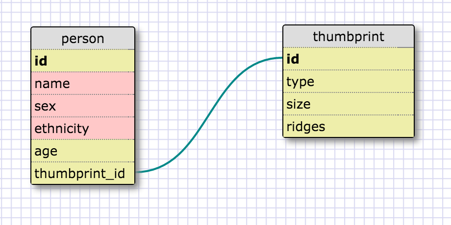
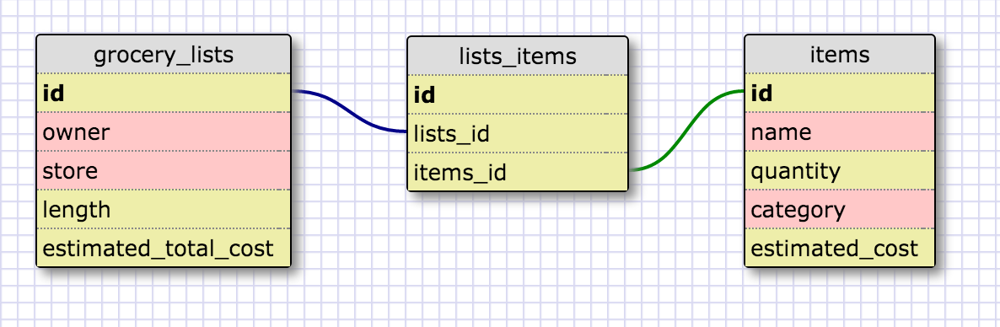

# 8.5 More Schemas

### Release 2:



This is a one-to-one schema because only one person can match a given thumbprint, and a given person can only have one thumbprint. A thumbprint cannot exist without a person to create it, yet in theory a person could exist without a thumbprint (e.g. a poor fellow who lost all his fingers!).

### Release 4:



## Reflection:

**What is a one-to-one database?**  

A one-to-one database is a database where each data type is uniquely related to the other. See Release 2 for an example.  

**When would you use a one-to-one database? (Think generally, not in terms of the example you created).**  

One reason you would want to use a one-to-one database is when you have a table with many attributes that you likely won't use often. You can split these into a different table, which will have a one-to-one relationship with the remaining attributes of the original table, and it will save space in your database.  

**What is a many-to-many database?**  

A many-to-many databse is a database where many data types relate to many other data types. See Release 4 for an example.  

**When would you use a many-to-many database? (Think generally, not in terms of the example you created).**  

You would want to use a many-to-many database when you have sets of data that can relate to multiple instances of each other.  

**What is confusing about database schemas? What makes sense?**  

One-to-one databases are a bit confusing for me. It was really difficult to think of examples or scenarios of when one would need to use one. Otherwise, one-to-many and many-to-many databases make sense and seem to be the most common types.